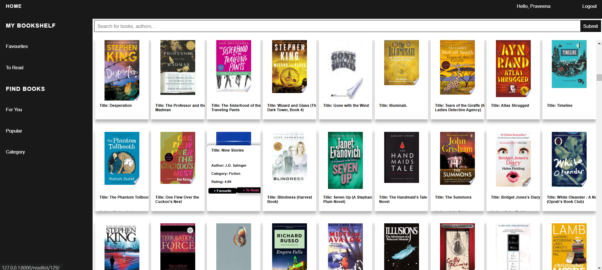

# Book Recommendation System  

This repository contains a **Book Recommendation System** designed to help users discover books tailored to their interests. The system leverages collaborative filtering techniques to provide personalized recommendations based on user and book data.  

---

## Features 🌟

- **Personalized Book Recommendations:** Suggests books tailored to each user's interests based on their ratings and preferences.  
- **Collaborative Filtering:** Implements user-based and item-based collaborative filtering to analyze user behavior patterns effectively.  
- **Efficient Data Handling:** Utilizes sparse matrix representation for computational efficiency during model training and predictions.  
- **Evaluation Metrics:** Includes RMSE to measure the accuracy of predictions against actual ratings.  
- **Interactive Jupyter Notebook:** Offers a step-by-step guide for data preprocessing, model building, and generating recommendations.  

---

## How to Use  

To set up and run the project:  

1. Clone the repository:  
   ```bash  
   git clone https://github.com/yourusername/Book-Recommendation-System.git  

2. Create and activate a virtual environment:
   ```bash
   python -m venv venv
   source venv/bin/activate  # On Windows, use `venv\Scripts\activate`
   ```
3. Install dependencies:
   ```bash
   pip install -r requirements.txt
   ```
4. Run the Django development server:
   ```bash
   python manage.py runserver
   ```
5. Access the app: Open your browser and navigate to ```http://127.0.0.1:8000```

## Workflow  

### 1. Data Loading and Preparation  
- The ratings data is loaded from a CSV file.  
- A **user-item matrix** is created, where:  
  - Rows represent users.  
  - Columns represent books.  
  - Values represent ratings.  
- Missing values are filled with `0`.  
- The matrix is converted into a **sparse format** to enhance computational efficiency.  

### 2. Collaborative Filtering  
- **Cosine Similarity:**  
  - Similarity between users is calculated using cosine similarity.  
  - Helps determine which users have similar preferences.  
- **Prediction:**  
  - Predictions are made by weighting users' ratings with their similarity scores.  
  - Ensures recommendations are based on both similarity and historical ratings.  

### 3. Evaluation  
- The model's predictions are evaluated using **Root Mean Squared Error (RMSE)**.  
- RMSE measures the accuracy of predicted ratings by comparing them against the actual ratings.  

---

## Dataset  

The recommendation system uses three key datasets:  

### Books.csv:  
- Metadata about books, such as:  
  - Book ID  
  - Title  
  - Author  
  - Publication Year  
  - Publisher  

### Ratings.csv:  
- User ratings for various books, with fields:  
  - User ID  
  - Book ID  
  - Rating (on a scale of 1-5)  

### Users.csv:  
- Demographic information about users, including:  
  - User ID  
  - Location  
  - Age  

---

## Project Structure 🗂️

```plaintext
Book-Recommendation-System/  
├── Main/                              # Django project settings and configurations  
│   ├── __init__.py  
│   ├── asgi.py  
│   ├── settings.py  
│   ├── urls.py  
│   ├── wsgi.py  
├── Notebooks/                         # Jupyter notebooks for data exploration and model building  
│   ├── Collaborative Filtering.ipynb  
│   ├── Data Extracting.ipynb  
│   ├── Popular Books.ipynb  
│   ├── Books.csv                      # Dataset containing book metadata  
│   ├── Ratings.csv                    # Dataset containing user ratings  
│   ├── Users.csv                      # Dataset containing user information  
│   ├── books_details.csv               
│   ├── popular_books.csv               
│   ├── system1.png                    
├── books/                             
│   ├── __init__.py  
│   ├── admin.py  
│   ├── apps.py  
│   ├── filters.py  
│   ├── forms.py  
│   ├── models.py                      # Database models for books and users  
│   ├── templates/                     # HTML templates for the web interface  
│   ├── tests.py  
│   ├── urls.py  
│   ├── views.py                       # Views to handle HTTP requests  
├── db.sqlite3                         # SQLite database file   
├── manage.py                          # Django management script  
├── static/                            # Static files for the web interface  
```

## Requirements  

The project requires:  
- **Python 3.7+**  
- **Django**  
- **Jupyter Notebook**  
- **pandas:** For data manipulation  
- **numpy:** For numerical computations  
- **scikit-learn:** For collaborative filtering and evaluation  

---

## Future Enhancements  

1. **Real-Time Integration:**  
   - Extend the system to work with live data for real-time recommendations.  
2. **Hybrid Filtering:**  
   - Combine collaborative and content-based filtering for improved accuracy.  
3. **Improved Interface:**  
   - Develop a user-friendly web or mobile interface.  
4. **Performance Optimization:**  
   - Optimize for faster training and predictions, especially for large datasets.  

## Screenshot


